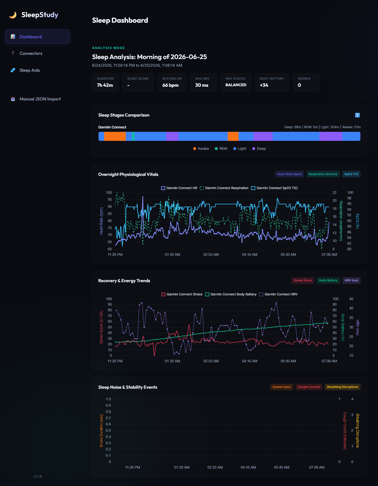

# sleepstudy.app

A self-hosted, offline-first dashboard designed to review, align, and annotate sleep datasets. It combines cloud-synced wellness stats from **Garmin Connect** with custom time-series snoring and coughing metrics pushed from secondary tracking devices or apps.

---

## Key Features

- ⌚ **Garmin Connect Sync**: Sync sleep score, stages (awake, REM, light, deep), resting heart rate, average HRV, body battery dynamics, respiration, and intraday heart rate.
- 🩹 **Sleep Aids Config & Selection**: Manage custom tag lists (e.g., Nose Strips, Mouth Tape, Eye Mask) and log sleep positions (Back, Left Side, Right Side, Stomach) in an interactive sleep journal.
- 🎤 **Snore & Cough Custom App API (Preview)**: A REST API endpoint to ingest sound events from a custom device. Automatically aligns and merges these sounds with your Garmin vitals using deterministic session matching.
- 📱 **QR Code Enrollment**: In-app QR code generation representing your endpoint to instantly auto-configure mobile client applications.
- 🔊 **Sleep as Android Webhook (Preview)**: Webhook integration to record real-time audio occurrences.
- 📦 **Dockerized Deployment**: Fully self-contained container packaging for easy hosting on Unraid, Synology, or local homeservers.
- 💾 **Self-Healing Database**: Runs on a local SQLite instance with startup auto-migrations to safely upgrade schemas without data loss.

---

## Documentation

To help you get started with deploying, configuring, and updating the application, please refer to the following guides:

- 🚀 **[Installation & Setup Guide](docs/setup.md)**: Steps for building the Docker image, mapping persistent volumes, and understanding the SQLite table schemas.
- 🔌 **[Data Connectors & APIs Specification](docs/connectors.md)**: Technical specs for the Garmin Cloud Auto-Sync daemon, the Snore & Cough HTTP POST JSON schema, and the Sleep as Android webhook endpoint configuration.
- 📝 **[Changelog](CHANGELOG.md)**: History of releases, features added, and versions tracking.
