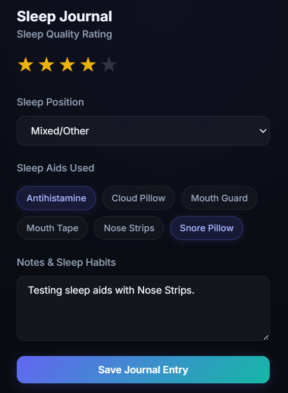
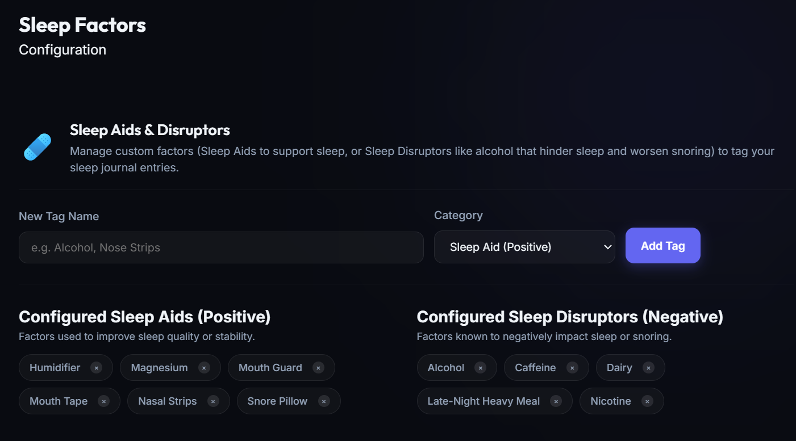

# Sleep Journal & Sleep Aids Guide

The Sleep Journal and Sleep Aids system in `sleepstudy.app` allows you to track, correlate, and persist subjective qualitative variables alongside your biometric sleep stages and vitals. By cataloging sleep aids, positions, and custom notes, you can easily identify what interventions lead to optimal deep sleep, higher HRV, and lower resting heart rates.

---

## 1. The Sleep Journal

When you select any sleep session from the main dashboard, the **Sleep Journal** panel loads on the right side of the screen.

### Journal Parameters:

1. **Sleep Rating**: Evaluate your subjective recovery quality from 1 to 5 stars.
2. **Sleep Position**: Choose your primary sleep orientation during the night (e.g., *Back*, *Left Side*, *Right Side*, *Stomach*, or *Mixed/Other*).
3. **Sleep Aids**: Click to toggle active aids used for that specific night's sleep. Active aids glow indigo.
4. **Notes & Sleep Habits**: A freeform text field to log extra context, such as room temperature, exercise, late meals, caffeine consumption, or stress levels.

Click **Save Journal Entry** to write changes directly to the persistent SQLite database.

---

## 2. Managing Custom Sleep Aid Tags

You can customize the available sleep aid tags by navigating to the **Sleep Aids** tab in the left sidebar navigation menu.

### Adding a New Tag:
1. Go to the **Sleep Aids** page.
2. Enter a descriptive name in the **New Sleep Aid Tag** input field (e.g., `Mouth Tape`, `Nose Strips`, `Weighted Blanket`).
3. Click the **Add Tag** button. The tag will instantly become available under the Sleep Journal panel for any sleep session.

### Deleting a Tag:
- Click the small close (`x`) icon on any active pill under **Currently Configured Tags**.
- Deleting a tag removes it from the configuration pool. *Note: Existing journal entries that already have this tag saved will still retain it for historical accuracy.*

---

## 3. Database Storage & Schema Reference

Sleep journal and position records are stored inside your persistent SQLite volume (`/app/data/sleep_study.db`).

- **`sleep_sessions`**:
  - `rating`: Stores the integer star rating (1-5).
  - `sleep_position`: String representing the chosen dropdown option.
  - `sleep_aids`: Comma-separated list of active aid names (e.g., `Nose Strips,Mouth Tape`).
  - `notes`: Text column for notes and annotations.

- **`sleep_aids`**:
  - `name`: Primary text identifier of the tag.
